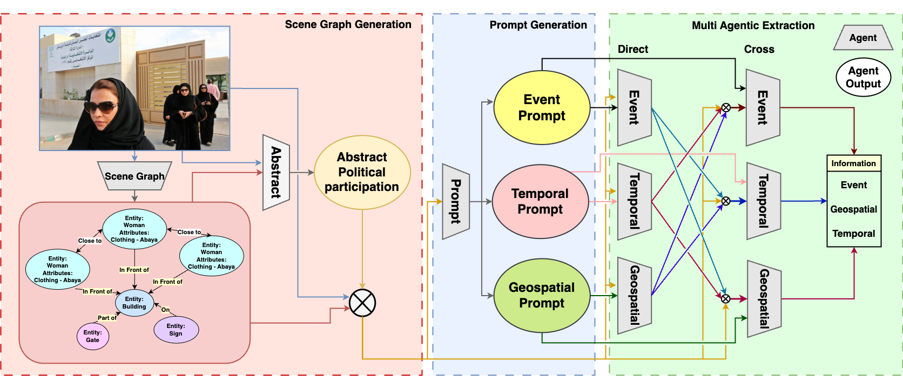

# GETReason: Enhancing Image Context Extraction through Hierarchical Multi-Agent Reasoning

<div align="center">


**A structured multi-agent framework for extracting rich, contextual narratives from public event images**

[Paper](https://aclanthology.org/2025.acl-long.1439/) | [arXiv](https://arxiv.org/abs/2505.21863) | [Code](./code/) | [Dataset](./code/dataset/) | [Website](https://coral-lab-asu.github.io/getreason/)

**📊 [Presentation Slides](https://docs.google.com/presentation/d/1UtUWE3_PSAT6RmpjAil7PZXGMpil456_/edit?usp=sharing&ouid=106492274501693178273&rtpof=true&sd=true)** | **🎥 [Video](https://drive.google.com/file/d/1sLM8x3x8X3K25oSMJl0gukmUWuRAc3Jc/view?usp=drive_link)** | **📄 [Poster](https://drive.google.com/file/d/1EcWrWB0Mo_Y0vFhIXce9dRORGmdhcVeh/view?usp=drive_link)**

</div>

---

## 🎯 Overview

GETReason is a novel framework that goes beyond surface-level image descriptions to infer deeper contextual meaning from publicly significant event images. Our approach uses a hierarchical multi-agent reasoning system to extract geospatial, temporal, and event-specific information, enabling comprehensive understanding of visual narratives.

### Key Features

- **🔍 Multi-Agent Architecture**: Specialized agents for geospatial, temporal, and event reasoning
- **🔄 Cross-Generation**: Collaborative validation between agents for enhanced accuracy
- **📊 GREAT Metric**: Novel evaluation metric for reasoning quality assessment
- **🎯 Event Understanding**: Focus on sociopolitical significance rather than just visual content
- **📈 Robust Performance**: Substantial improvements over existing captioning and reasoning baselines

## 🏗️ Architecture

<div align="center">



*GETReason's hierarchical multi-agent reasoning framework*

</div>

### Agent Specialization

- **🌍 Geospatial Agent**: Infers location, country, city, and geographic context
- **⏰ Temporal Agent**: Extracts dates, periods, and historical context
- **🎭 Event Agent**: Identifies events, political significance, and sociopolitical context

## 📊 Results

Our framework demonstrates significant improvements:

- **Enhanced Accuracy**: Better geospatial and temporal inference
- **Reduced Hallucinations**: Structured approach minimizes misleading information
- **Improved Generalization**: Robust performance across diverse event types
- **Contextual Understanding**: Deeper insights into event significance

## 🗂️ Repository Structure

```
getreason/
├── README.md                 # This file - Project overview
├── code/                     # Implementation and experiments
│   ├── README.md            # Detailed setup and usage instructions
│   ├── gpt_workbench.ipynb  # GPT-4o-mini experiments
│   ├── gemini_workbench.ipynb # Gemini experiments
│   ├── dataset/             # Augmented datasets
│   │   ├── gold_tara.jsonl  # TARA dataset (11,240 samples)
│   │   └── gold_wikitilo.jsonl # WikiTilo dataset (6,296 samples)
│   └── assets/              # Prompts, schemas, and data
└── Paper/                   # Research paper implementation
    └── GETReason/           # Single image workflow
```

## 🚀 Quick Start

For detailed setup and usage instructions, see the [code directory](./code/):

```bash
# Clone the repository
git clone https://github.com/coral-lab-asu/getreason.git
cd getreason

# Navigate to code directory for implementation
cd code

# Follow the detailed setup instructions in code/README.md
```

## 📚 Datasets

We provide two augmented datasets with comprehensive annotations:

### TARA Dataset

- **Size**: 11,240 samples
- **Content**: Rich event information with reasoning
- **Coverage**: News events from 2010-2021

### WikiTilo Dataset

- **Size**: 6,296 samples
- **Content**: Temporal and geospatial information
- **Coverage**: Historical events from 1826-2021

## 🔬 Research Impact

GETReason addresses critical challenges in:

- **📰 Journalism**: Automated event understanding for news analysis
- **📚 Education**: Historical context extraction for educational content
- **🏛️ Archival Analysis**: Systematic organization of event imagery
- **🔍 Fact-Checking**: Reliable extraction of contextual information

## 📄 Citation

If you use this work in your research, please cite:

```bibtex
@inproceedings{siingh-etal-2025-getreason,
    title = "{GETR}eason: Enhancing Image Context Extraction through Hierarchical Multi-Agent Reasoning",
    author = "Siingh, Shikhhar  and
      Rawat, Abhinav  and
      Baral, Chitta  and
      Gupta, Vivek",
    booktitle = "Proceedings of the 63rd Annual Meeting of the Association for Computational Linguistics (Volume 1: Long Papers)",
    month = jul,
    year = "2025",
    address = "Vienna, Austria",
    publisher = "Association for Computational Linguistics",
    url = "https://aclanthology.org/2025.acl-long.1439/",
    doi = "10.18653/v1/2025.acl-long.1439",
    pages = "29779--29800"
}
```

## 👥 Authors

- **Shikhhar Siingh** - Arizona State University
- **Abhinav Rawat** - Arizona State University
- **Chitta Baral** - Arizona State University
- **Vivek Gupta** - Arizona State University

## 📞 Contact

For questions, or issues, or collaboration:
- **Vivek Gupta**: vgupt140@asu.edu

## 📄 License

This project is licensed under the MIT License - see the [LICENSE](LICENSE) file for details.

---

<div align="center">

**GETReason: Enhancing Image Context Extraction through Hierarchical Multi-Agent Reasoning**

[](https://aclanthology.org/2025.acl-long.1439/)
[](https://arxiv.org/abs/2505.21863)

</div>
